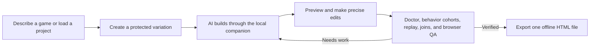

# LoopLab

### Panda's AI-first HTML 2D/2.5D Game Builder

[](https://github.com/PandaCatz/Panda-s-HTMl-2D-2.5D-Game-Builder/actions/workflows/ci.yml)
[](https://github.com/PandaCatz/Panda-s-HTMl-2D-2.5D-Game-Builder/actions/workflows/codeql.yml)

LoopLab is a local-first, agent-first workshop where Codex, Claude, and provider APIs can design, build, inspect, playtest, improve, and export browser games. The Windows UI is the user's secondary direction, inspection, and precise-tweak surface over those same capabilities.

Its target is intentionally focused: polished **2D and dimetric/isometric 2.5D games** that ship as **one playable, offline HTML file**.

LoopLab is not merely a prompt box that returns a demo. It is an authoring system built around persistent project data, protected variations, precise map and asset tools, deterministic gameplay evidence, visual browser QA, and a canonical headless interface. Agents operate the complete workflow through strict commands and compact state; the user can direct it with a prompt, inspect evidence, or make exact mouse edits without limiting what agents can do.

> **Project status:** LoopLab is under active development. The core create-preview-adjust-verify-export workflow works, but interfaces and schemas may still evolve before a stable release.

## Why LoopLab exists

AI can produce an HTML game quickly. Producing one that stays coherent after repeated edits is much harder.

Common failures include artwork that disagrees with collision, floating props, unstable sprite anchors, broken map transitions, inaccessible routes, depth mistakes, inert “features” that exist only in prose, lost work after a rejected generation, duplicated provider requests, and exports that quietly depend on a server or CDN.

LoopLab turns those recurring failures into explicit authoring contracts and reusable tools. When a difficult problem is solved, the goal is to encode the solution into the builder, Project Doctor, runtime, headless API, or regression suite so later games do not repeat it.

## What sets LoopLab apart

| Principle | What it means in practice |
| --- | --- |
| **AI-first, not UI-limited** | The visual editor is a convenient control surface. The versioned headless contract is the capability superset, so agents can use exact IDs, coordinates, batches, project state, and evidence without being constrained by visible dropdowns. |
| **Bounded automation stays unambiguous** | Compact clients always receive complete parseable JSON. If a large mutation succeeds, its receipt explicitly says it was applied and must not be retried; complete embedded source travels through MCP or CLI instead of being silently truncated. |
| **Providers fail independently** | Codex CLI, OpenAI API, Claude Code CLI, and Anthropic API are separate paths. One can be missing, blocked, signed out, or rejected without disabling the others. Default jobs automatically continue through ready alternatives while retaining requested/actual provider, ordered failures, and usage; strict mode locks an exact path. |
| **A good human run can become durable evidence** | New playtests capture exact simulation-tick inputs. A reviewed run can become a source-bound replay fixture only through digest-gated preview/apply and the ordinary canonical replay recorder. |
| **Authored truth beats plausible pixels** | Art, collision, support height, traversal, navigation, anchors, and depth are separate layers. Generated imagery never becomes gameplay geometry automatically. |
| **Visual identity is project truth, not prompt folklore** | An optional versioned contract records intent, role-scoped directives, exclusions, and project-asset references. AI art inherits it by default, explicit user locks stay authoritative, and every image-reference upload requires fresh one-job consent. |
| **The loop preserves the best version** | “Loop” means generating, testing, comparing, and refining newer candidates—not simply repeating an animation. Base projects can be copied into protected variations, and regressing candidates are rejected without replacing the strongest verified result. |
| **Different games are judged as different games** | Each run freezes an explicit or auto-selected General, Platformer, Top-down, Connected-world, or Systems profile from the starting authored project. Independent hard gates and named dimension vectors replace platformer-biased coin/hazard scoring; the score never claims fun or visual taste. |
| **Mechanics are decisions, not a verb quota** | Verb-system v2 allows one deep verb or several justified ones. It binds each mechanic to purpose, affordances, state, feedback, runtime proof, independent uses, recurring relationships, recovery, progression, and resource flow; Project Doctor rejects prose-only or finale-only combinations. |
| **Codex and Claude share one loop contract** | Both CLIs receive the same selected project, bounded context, pass plan, frozen evaluator, canonical command authority, regression gates, evidence requirements, ledger shape, and usage rules. Provider-specific transport remains attributable, while creative output is allowed to differ. |
| **The runtime is chosen for the game** | Canvas, Phaser 3.90.0, PixiJS 8.19.0, and melonJS 17.4.0 are all release-ready one-file adapters. LoopLab scores the game’s actual needs, pins and SHA-256 checks every optional engine, and never silently migrates an existing project. Pixi combines its official browser UMD with its official strict-CSP static synchronizers; melon uses a tree-shaken standalone-application IIFE with an explicit camera. All four keep LoopLab’s deterministic simulation and authored collision authoritative. |
| **Quality claims require evidence** | Project Doctor, executable acceptance tests, deterministic replay, runtime map-join checks, visual captures, and browser playtests distinguish working behavior from convincing prose. |
| **Design gaps become observable** | Deterministic behavior cohorts probe routes, actions, mechanics, combinations, rules, choices, traversals, portals, contacts, and meaningful events. They reveal likely dead or underused design, while explicitly refusing to claim that bots prove fun, taste, fairness, accessibility, or visual quality. |
| **2.5D without becoming a 3D engine** | Exact 2:1 dimetric maps may use authored world x/y/z for elevation, supports, collision separation, and draw order while rendering only 2D tiles, sprites, and Canvas operations. |
| **Long AI work is durable** | Provider jobs belong to the local companion, not a short-lived shell command. A caller submits once, retains the job ID, and monitors the same run instead of duplicating it after a timeout. |
| **Complex builds get real context** | Agents and users can select bounded 32k–200k provider-context budgets. Complex work defaults to 96k, Claude CLI receives up to five structured turns, and every completed run reports measured—not guessed—usage. |
| **Headless routing is authoritative** | `start_ai_build.provider` names the requested path and the default fallback policy tries it first. Any change to a different ready CLI/API path is explicit in the route, events, result, usage, and failover receipt; strict mode never changes paths. A stale mouse selection cannot silently choose the provider. |
| **Optional local AI stays subordinate** | Ollama, LM Studio, or another explicitly configured loopback OpenAI-compatible model may summarize bounded context, critique plans, identify risks, and suggest next intents. It cannot run tools, mutate projects, own collision, replace Codex/Claude, or produce verification evidence. |
| **Solved problems become shared operating knowledge** | A versioned, evidence-backed Agent Playbook gives Codex and Claude the same proven recovery and release recipes. Recipes are read-only context; they never execute themselves or bypass normal gates. |
| **One file is the shipping contract** | The finished game embeds its runtime, maps, selected art, styles, controls, and metadata into one offline HTML artifact that can open directly from disk. |
| **Codex and Claude share the same workshop** | Both CLIs use the same project schema, headless commands, source-digest preconditions, verification gates, and exporter. Provider-specific output never creates a second authoring model. |

## The continuous workflow



1. **Start from words or existing work.** Describe a game, load an editable project folder, import a LoopLab-generated HTML file, or choose a template.
2. **Direct the build.** Combine free text with optional genre, core-loop, movement, camera, progression, map-scope, workstream, research, and art-direction guidance.
3. **Protect the baseline.** Create a named variation before experimentation so a provider pass cannot damage the base project.
4. **Generate once and monitor.** OpenAI, Anthropic, Codex CLI, or Claude Code CLI runs through the local companion. Long jobs remain inspectable by ID.
5. **Inspect visually and structurally.** Edit maps, routes, objects, supports, assets, animation metadata, collisions, and connections through the UI or headless commands.
6. **Prove and interrogate the result.** Run Project Doctor, deterministic behavior cohorts, replay and acceptance fixtures, runtime transition checks, responsive visual capture, and Playwright-based browser QA. Cohorts surface design questions; browser and human judgment answer them.
7. **Refine or ship.** Reject regressions, keep the best candidate, and export the verified game as a single self-contained HTML file.

## Major workspaces

### AI Director

The Director turns a free-form vision and optional structured choices into provider input without replacing the user's words. It supports one-pass generation, iterative improvement, focused workstreams, prompt retry, research, provider selection, usage receipts, and a live event console.

Its **Playable foundation** reviewer can start a new game from several complete technical shapes instead of one platformer-biased scaffold. It inspects real platformer, top-down, systems/choice, connected kinetic, and exact dimetric 2.5D sources; derives readiness from validation, Project Doctor, state-changing runtime rules, acceptance, replay, and completion evidence; and ranks brief-compatible alternatives without choosing a creative winner. Existing projects are protected. On a named variation, one exact source/candidate digest materializes only into the ordinary non-mutating preview path; Apply remains disabled until that unchanged preview passes. Art, narrative, balance, originality, and fun remain visible gap-ledger or judgment work rather than fabricated proof.

Its **2D runtime** control defaults to Auto. LoopLab scores concrete quality-fit signals—tilemaps, scene orchestration, camera tooling, sprite animation, physics needs, renderer-heavy particles/filters, Tiled/TMX workflows, map count, custom dimetric depth, and package budget—and returns a versioned decision receipt explaining the result. The same native knowledge model records the strengths, costs, reusable patterns, and failure modes of Canvas, Phaser, PixiJS, and melonJS. Every candidate is release-ready: Canvas is built in; Phaser uses the pinned browser script; Pixi uses the pinned browser UMD plus its official no-`unsafe-eval` static synchronizers; melon uses a pinned tree-shaken IIFE and standalone application lifecycle. Exactly one runtime owns frames, while LoopLab owns simulation, input semantics, collision, replay, DOM UI, and export truth. The mouse UI, headless API, CLI/MCP, OpenAI, Anthropic, Codex CLI, and Claude CLI all consume the same selection receipt.

Narrative routing is conditional rather than forced onto every game. Story, dialogue, NPC, quest, lore, environmental-storytelling, branching-choice, or narrative-workstream signals add two ordered stages to the same provider request: a **Narrative Designer** for causality, continuity, choices, state bindings, and endings, plus a **Narrator & Dialogue Writer** for voice, dialogue, barks, tutorial copy, and readable text equivalents. Their shared source `narrativeContract` binds lines, required beats, and endings to stable gameplay/map/feature IDs and acceptance evidence. Project Doctor derives a bounded Narrative Report for missing references, unreachable pages or beats, blocking terminals, trap cycles, endings, audio-only essentials, and stale or missing proof. Mechanics-first work receives neither role unless explicitly included.

Every generation uses a visible acceptance profile. `Auto` derives it once from the starting authored project and freezes it for the complete run, so a candidate cannot change the metric used to judge itself. Candidate receipts show integrity, playability, executable evidence, world authoring, campaign continuity, systems/choice, and a deliberately limited presentation-readiness proxy. A candidate must keep every applicable dimension non-regressing and pass the independent schema, Doctor, spatial, acceptance, replay, completion, input, map-join, and gameplay-program gates.

Codex and Claude are adapters around that same process, not separate builders. A digest-bound `looplab-provider-parity/v2` contract and per-run `provider.parity.locked` receipt prove which shared semantics and frozen acceptance profile governed the run. LoopLab still reports the provider that executed it, because operational parity does not mean identical model creativity, wording, latency, token count, or candidate quality.

Candidate selection is shared too. `compare_iterations` returns a source-bound `looplab-candidate-decision/v1` packet to the UI, CLI, MCP, Codex, and Claude. Its nested `looplab-structural-iteration-diff/v1` receipt compares stable authored map, object, object-collider, collision-chain, and canonical tile-collider IDs in world space, with exact before/after geometry, complete totals, and explicitly bounded detail. The mouse ledger renders the same digest as a shape-, line-style-, and label-redundant overlay. Array order, proximity, names, artwork, and pixels never establish identity or collision. Hard gates constrain feasibility and matching frozen-profile dimensions expose dominance or tradeoffs, but `automaticWinner` remains `null`: structural change is evidence, not quality, and both candidates must be previewed and played before a human-directed choice determines the next editable parent.

The UI is not a ceiling: headless callers may provide additional constraints or complete low-level commands that have no matching visual control.

### Map Studio

Map Studio handles side-scrolling, top-down, connected-map, and exact dimetric 2.5D worlds. It keeps the following independently authored:

- world position and visual elevation;
- ground-contact anchors and gameplay footprints;
- floor and raised-surface support contacts;
- collision volumes and traversal paths;
- navigation layers, nodes, links, and blocked/walkable areas;
- deterministic depth bands and occlusion slices;
- portals, destination spawns, and player-facing map order.

The bundled Path Editor exchange preserves rich routes instead of flattening them into simple lines. Timings, waits, facing, animation cues, meetings, events, elevation, depth bias, and evidence digests survive supported round trips.

### Canonical tile layers and deterministic autotiling

Each map may own a strict `looplab-tile-program/v1` with sparse visual layers, palette/frame references, authored terrain signatures, deterministic weighted variants, and entirely separate collision layers. Orthographic maps use their authored cell size; dimetric maps keep exact 128×64 art while logical coverage remains in reversible world cells. Missing terrain signatures are blockers instead of guessed seams, and changing pixels can never rewrite collision.

Map Studio's **Tiles** tool initializes from selected embedded tilesets, exposes visual and collision layers independently, paints direct tiles, authored terrain IDs, or collision profiles, and sends every click through the same source-digest and tile-digest-bound `preview_tile_patch` → `apply_tile_patch` workflow used by Codex, Claude, CLI, MCP, and the browser bridge. Project Doctor validates bounds, chunks, transforms, assets, signatures, projection, locks, and collision ownership. The one-file runtime compiles the same source into deterministically sorted render entries and merged collision rectangles; `getTileProgram()` / `get_tile_program` and `getTileRuntime()` / `get_tile_runtime` expose bounded inspection without giving a renderer ownership of map truth.

### Fine Tune

Fine Tune exposes precise object, map, collider, support, asset, and route controls for human adjustments after an AI pass. Floor-standing props such as vending machines, benches, ramps, kiosks, rails, and buildings can be attached to an explicit ground or raised support instead of being positioned from an unreliable image center.

Its **Measured gameplay tuning** workbench turns another recurring AI failure—guessing movement constants—into a bounded, reviewable process. LoopLab measures acceleration, stopping, jump rise, apex, airtime, and travel from the canonical runtime; prepares an editable versioned Tuning Contract; and deterministically explores a finite grid or stratified sample. Every candidate is checked by schema validation, both Doctor profiles, acceptance, replay, completion, input-liveness, and runtime-join gates. The result is a set of safe measured Pareto tradeoffs with `automaticWinner: null`, never a claim that a number proves fun. Search is read-only and costs zero provider tokens. A changed candidate must be exact-previewed and explicitly applied to a protected variation; LoopLab never silently rerecords replay or acceptance evidence.

Its **Deterministic design behavior cohorts** run bounded idle, action-sweep, seeded-explorer, completion-witness, isolated-map, and single-action-pressure policies against a cloned canonical runtime. The report separates natural-route coverage from isolated probes and shows exact replay hashes, map/action/mechanic/combination/rule/choice/traversal/portal coverage, meaningful-event density, stalls, and concrete follow-up questions. It is read-only, source-bound, reproducible at fixed 60 Hz, and costs zero provider tokens. The result is a diagnostic for dead mechanics, trivial dominant solutions, stalled routes, unused maps, weak combinations, and unexercised authored content—not a simulated focus group. A provider critique, visual browser playtest, and human-directed comparison still decide whether the game is understandable, attractive, fair, original, or fun.

Its **Event-driven presentation** workbench maps canonical and authored gameplay events to bounded procedural Web Audio cues, selected embedded OGG/WAV samples, and renderer-neutral particles, shake, flash, and squash. Imported samples stay in `project.resources`; `sample` cues bind them by stable ID. Project Doctor rejects missing, non-audio, unsupported, over-encoded, or over-decoded bindings and reports both one-file bytes and decoded 32-bit PCM memory. The exact artifact decodes only referenced clips after a real gesture, shares the authored voice cap, envelopes, limiter, mute/pause lifecycle, and isolates one failed clip without stopping gameplay. The same strict `presentationProgram` drives editor preview and every release-ready renderer; presentation never enters collision, completion, simulation, acceptance, or replay hashes. Technical validity still does not prove artistic quality or game feel.

### Deterministic moving objects

Moving platforms, hazards, doors, carriers, and environmental machinery can now follow authored paths under fixed-tick simulation. They may respond to a held semantic action or run automatically, use stop or ping-pong endpoints, and resolve substepped X/Y collision against authored solids and the player. The Canvas and Phaser adapters render the same canonical pose; neither owns a parallel physics object.

The same capability is available to Codex, Claude, MCP, CLI, the live browser, Project Doctor, and exported one-file games through strict `set_motion_body`, `remove_motion_body`, `get_motion_body_report`, and runtime-state contracts. Save-state v2 persists latent movement state only when needed, replay v5 hashes it without changing accepted v1-v4 fixtures, and production evidence must prove activation, release, blocking, endpoints, and cross-map persistence.

### Authored collision chains and slopes

Maps can carry strict connected collision chains for slopes, terrain lips, boundaries, and elevation-separated 2.5D routes. Point order defines a visible right-hand normal; stable segment order, half-open endpoint ownership, bounded sweeps, grounded floor snap, step-up limits, and explicit z ranges keep seams and overpasses deterministic. Generated art, sprite bounds, and screen projection never create gameplay geometry.

Codex, Claude, MCP, CLI, Map Studio, Project Doctor, replay, and the one-file runtime share the same `get_collision_geometry`, `get_collision_geometry_report`, `suggest_collision_geometry`, `set_collision_geometry`, and `remove_collision_geometry` contract. Map Studio draws control points and normals and allows reviewed chains to be created or moved. Replay v9 records contacted chain/segment and normal state while v1–v8 remain byte-compatible; exported games expose read-only `getCollisionGeometry()` / `get_collision_geometry`, including separately attributed tile collision rectangles.

### Deterministic combat substrate

Projectile, health, hit, and targeting mechanics can be authored as one strict renderer-neutral combat program. Teams, actors, semantic-input emitters, integer damage, fixed projectile slots, cooldowns, aim rules, and stable tie breaks run in the canonical simulation; swept tests consume authored colliders and elevation, so generated art never invents hit geometry. Launch, hit, defeat, expiry, and overflow events can drive presentation without entering combat truth.

The same `get`/`report`/`suggest`/`set`/`remove` workflow is available to Codex, Claude, MCP, CLI, Fine Tune, Project Doctor, replay, acceptance, and the exported runtime. The provider-free starter is read-only and never silently edits a project. Save-state v3 and replay v7 include combat state while earlier replay versions remain frozen.

### Deterministic actors, navigation, and perception

NPCs, enemies, companions, guards, and cutscene actors can now use one strict renderer-neutral actor program. Each actor binds to an authored map object, collider, support height, navigation graph, home node, and optional target. Fixed-tick behavior supports hold, patrol, chase, flee, return, and cutscene routes with explicit transition priority, bounded repathing and memory, arrival radii, field of view, line of sight, stable tie breaks, and collision stops. Route steps must follow authored directed links; a renderer or generated image cannot invent a shortcut or gameplay shape.

The same `get_actor_program`, `get_actor_report`, `suggest_actor_program`, `set_actor_program`, and `remove_actor_program` workflow is available to the UI, Codex, Claude, MCP, CLI, provider context, Project Doctor, acceptance, and one-file export. The exported runtime exposes read-only `getActorStates()` / `get_actor_states`, while actor events can drive the independent presentation layer. Save-state v4 and replay v8 preserve all actor state that can affect later ticks without changing frozen v1–v7 replay projections. Actor-bearing work automatically routes an Actor Systems Designer stage inside the existing single-provider plan; it does not require a separate model invocation.

### Gameplay systems

LoopLab is not organized around platformers. Genre-neutral choice/dialogue pages, typed variables, bounded integer formulas, turn/day/round clocks, state rules, events, and accessible HUD bindings can drive narrative, trading, management, tactics, RPG, puzzle, top-down, platforming, or dimetric games. The built-in **Lantern Market Ledger** starter deliberately has no player object or movement loop; it proves the same systems through semantic input, Project Doctor acceptance, replay v4, headless control, visual preview, and one-file export.

### Tile & Sprite Lab

The asset workflow supports deterministic fallback generators, prompt-directed AI art jobs, installed CC0 packs, palette locking, shared-scale normalization, ground anchors, frame analysis, atlas packing, and decoded-memory accounting.

Provider pixels remain source art. An asset that fails measurement can stay available for review, but it is not attached as “game-ready,” and it never owns collision.

### Project visual identity

LoopLab can store one optional, versioned `visualIdentity` contract beside the editable project. It records the authored intent, role-scoped palette/value/shape/outline/lighting/material/texture/projection/proportion/scale/motion/UI directives, explicit exclusions, and references to existing project assets. The contract is a shared source for the Director, AI art, grounded visual critique, Project Doctor, compact agent context, CLI, MCP, Codex, and Claude; it is not a hidden prompt fragment or a hard-coded house style.

AI-art jobs inherit the current identity by default. A caller may explicitly set `useVisualIdentity:false` for one exploratory job, but a provider cannot silently adopt, remove, or rewrite the project contract. Only directives explicitly marked `userAuthored:true` may be locks. Semantic references contribute their bounded note without uploading pixels. References marked `delivery:"image"` require fresh `referenceConsent:true` for that exact job, use OpenAI's multipart image-edit route, and are capped at four PNGs and 16 MiB of decoded input. Public requests and durable receipts retain only reference IDs, hashes, counts, and byte lengths.

The canonical headless operations are:

- `get_visual_identity` and `get_visual_identity_report` for source-bound inspection;
- `set_visual_identity` and `remove_visual_identity` for validated project mutations;
- `generate_ai_asset` for default inheritance, explicit one-job bypass, or consented image-reference generation.

Project Doctor validates schema, stable IDs, reference resolution, stored provenance, conflicting locks, and exact identity receipts on generated assets. That evidence does **not** prove beauty, originality, legal clearance, or provider adherence; captured-pixel review and explicit judgment remain separate. The authoring contract is omitted from the standalone runtime payload, while accepted selected assets still embed normally in the one-file game.

### Deterministic moving platforms

Moving platforms, doors, hazards, carriers, and machinery are authored simulation objects—not renderer tricks. Select an exact object and use the same provider-free `suggest_motion_body` command available to Codex, Claude, CLI, MCP, and the UI; persist only reviewed source with `set_motion_body` and inspect it with `get_motion_body_report`.

Motion-body v2 can carry the player on a solid fixed-z platformer platform by transferring the exact accepted fixed-tick delta. A blocked rider follows an explicit safe response: transactionally stop and hold, or respawn through the canonical spawn path. Project Doctor rejects floating anchors, missing authored paths/colliders, unsafe tuning, changing-z carry, and missing evidence. Replay v10 records rider, accepted-delta, and crush state while v1–v9 remain frozen; preview and the one-file runtime execute the same code.

### Project Doctor

Project Doctor is an independent technical gate, not an AI self-review and not a substitute for taste. It checks the current authored source for issues such as:

- unresolved or ambiguous supports, anchors, collision, depth, and route layers;
- unsafe deterministic motion bodies, including missing paths/actions, floating anchors, open collision loops, unbounded tuning, invalid rider/crush policy, changing-z carry, or missing acceptance evidence;
- invalid actor ownership, cross-map targets, missing or wrong-way navigation links, unauthored sight blockers, unbounded perception/repath settings, or missing actor acceptance evidence;
- invalid map counts, unreachable maps, or broken portal-to-spawn joins;
- declared controls with no executable player, rule, or choice consumer;
- inert gameplay promises and unresolved feature/test IDs;
- stale acceptance, replay, browser, and export evidence;
- incomplete art-pipeline proof and primary visual coverage;
- credential-shaped values, private keys, non-example email addresses, absolute local filesystem paths, or incomplete privacy-scan coverage;
- single-file packaging, decoded-memory, and runtime constraints.

A numeric score cannot excuse a blocker. Visual readiness is reported separately because measurable pipeline coverage is not the same thing as artistic quality.

## Headless by design

LoopLab currently exposes **185 core project commands** and **266 browser-session commands** through one versioned manifest. Every command carries a JSON Schema 2020-12 input contract, surface ownership, mutation metadata, and MCP safety annotations instead of relying on an agent to infer arguments from prose.

Codex and Claude can connect through the official MCP stdio protocol in two explicit profiles: a workspace-contained core file profile for deterministic `.loop.json` work, and a persistent Playwright-backed browser profile for project selection, provider jobs, visual review, preview input, and the complete live surface. `get_agent_brief` returns a bounded, campaign-accurate warm start with separate current-authoring and production-release Doctor assessments on the same source digest, so a prototype pass cannot masquerade as release readiness. `get_project_context` then supplies either the campaign index or exact selected map documents without embedded asset bytes, provider prompt bodies, secrets, snapshots, or exported HTML. Every context pack carries the exact Project Doctor source digest and an explicit omission policy. It is orientation—not mutation input or verification evidence—and `get_project` remains the deliberate complete-source fallback.

The companion-owned shared project store gives the CLI, browser, Codex, and Claude one canonical project library at `.looplab/projects/`. `sourceDigest` remains Project Doctor/gameplay truth; a separate strong `revisionDigest` covers the complete editable document and is the only ETag/`If-Match` precondition. `list_shared_projects` returns both compactly; `mount_shared_project` records an exact rebase base; `preview_shared_project_rebase` classifies independent stable-ID edits and refuses ambiguous conflicts; `apply_shared_project_rebase` updates only the reviewed browser draft and never auto-saves. `save_shared_project` requires the current revision or `createOnly:true`. Writes are serialized per project and committed through a flushed temporary file plus atomic replace. Startup, reconnect, selection, and HTTP 412 preserve local work. IndexedDB/localStorage are recoverable caches only, while `metadata.json` remains outside project, Doctor, provider, and export truth.

`get_agent_changes` adds resumable agent memory without turning chat history into project truth. Codex or Claude stores one opaque cursor, requests only later semantic edits after reconnecting, and follows bounded pages. If its bookmark has expired or belongs to another project feed, LoopLab returns `resyncRequired` and an exact warm-start path instead of a misleading empty result. The 128-event journal covers successful headless, mouse, provider, history, lifecycle, and coordination changes while excluding raw commands, prompts, provider content, credentials, embedded assets, snapshots, patches, and HTML. It is authoring metadata only and cannot alter the gameplay source digest or shipped one-file artifact.

Studio preference memory gives Codex and Claude an explicit, inspectable cross-project preference prior authored by the user without inventing a taste score. It stores only deliberate statements and source-bound candidate choices in browser-local builder state on the supported Windows host. Every prompt or build run receives a bounded receipt listing the exact relevant preference IDs; the current brief and explicit style locks always override them. Agents own the complete inspect/add/edit/exclude/import/export surface through strict browser-session commands; the mouse controls expose the same state as a secondary convenience. Memory never stores screenshots, prompts, provider responses, credentials, project source, replay data, or exported HTML, and file-only core commands never read it silently.

`draft_agent_plan` turns a bounded Codex, Claude, or user intent into a deterministic plan bound to that exact source. One narrow request may select a tested command macro, exact playbook recipe, or guarded canonical workflow. A broader request becomes explicit intent coverage plus ordered, resumable phases that compose those capabilities without dropping work behind the first phrase match. The plan publishes missing structured inputs, operation contracts, source-lineage and retry rules, current/release readiness, and SHA-256 plan/definition digests. It is deliberately provider-free and non-executing: drafting never writes the project, spends tokens, or grants mutation authority. Reads may retry, durable jobs resume by ID, and an applied mutation receipt must never be replayed automatically.

LoopLab is an agent workbench first. Its versioned commands, compact context, receipts, durable jobs, deterministic gates, and Codex/Claude parity are the canonical product surface. The Windows UI remains valuable for direction, evidence inspection, visual judgment, and precise tweaks, but it never limits the operations available headlessly.

Browser MCP defaults all calls to compact responses and strips redundant outer project data. Agents deliberately request complete state through `get_project` or an explicit `compact:false`; ordinary planning, diagnostics, and mutations do not pay the embedded-asset context cost by accident.

`get_privacy_report` is the shared source-bound privacy preflight for the UI, CLI, MCP, Codex, and Claude. It scans authored and generated project text locally for high-confidence credentials/private keys and review-sensitive email or absolute machine-path data, treats embedded data URLs as opaque, and returns only finding codes, sanitized structural paths, coverage metrics, repair actions, and digests. It never returns the matched value. Prompt drafting, game iterations, research, consented visual critique, OpenAI image generation, and the optional loopback copilot all repeat the check against their exact outbound text and fail before API fetch or CLI inference when the report is not clear. Project Doctor blocks production on every finding or incomplete scan; the standalone artifact gate repeats the check against the exact HTML bytes, and export receipt v5 binds both report digests to the current source. This bounded heuristic is a provider/publication/release gate, not proof that no identifying information exists.

The optional local AI copilot is real on-device inference, not another name for the deterministic companion and not a fifth primary build provider. Detection is passive `/v1/models` discovery on literal loopback and never downloads, loads, or invokes a model. Its jobs are durable and cancellable, but their strict JSON-Schema results are only adjacent working context for Codex or Claude. They cannot become reviewed commands, project truth, Doctor/replay/acceptance/browser/release evidence, or a silent fallback when a provider is unavailable.

`preview_batch` closes the gap between planning and mutation for arbitrary authored changes. It strict-validates each nested core command, runs the exact ordered batch against a clone, rolls back a mid-batch failure, compares both current-authoring and production Doctor results, and returns a canonical SHA-256 review receipt without changing the project. `apply_previewed_batch` re-creates that preview on the current source and writes only when both the source digest and preview digest still match. Provider calls, browser actions, coordination, lifecycle changes, nested macros, and nested batch operations keep their own explicit workflows.

`list_game_foundations`, `suggest_game_foundations`, and `materialize_game_foundation` expose the same Playable foundation workflow to the mouse UI, Agent API, MCP, CLI, Codex, and Claude. Search is deterministic, provider-free, and non-mutating; each result separates reference maturity from the prepared candidate's validation and Doctor state. It preserves unlike alternatives, returns `automaticWinner: null`, blocks direct replacement of loaded work, and refuses an unproven or stale candidate unless the caller explicitly reviews the exact gaps and authority flags. Materialization returns one ordinary `preview_batch` command, never an already-applied project.

`auto_repair` and `converge` turn repeatable Project Doctor mechanics into a guarded capability instead of another prompt. They are dry-run by default, provider-free, source-bound, and exact-digest-bound. Eligible changes are limited to deterministic local invariant restoration—such as ground/support attachment, authored collision authority, map-bound clamping, exact dimetric projection, explicit fresh-press sockets, culling padding, sparse signature metadata, and bounded traversal-point clamping. Route design, reachability, tuning, clearance, collider semantics, and art remain explicit judgment residue. `converge` repeats analyze → safe plan → clone execution → validation for a bounded number of passes with fixed-point and cycle detection; apply re-plans current truth and commits the exact projected result as one change.

`get_feel_report`, `suggest_tuning_contract`, `set_tuning_contract`, and `run_tuning_search` cover the judgment-sensitive balance boundary without pretending it is a mechanical repair. Targets are restricted to documented movement fields and declared numeric gameplay variables; arbitrary object paths and expressions are rejected. The search includes the current baseline, caps the candidate budget at 24, keeps failures visible, exposes ordinary `preview_batch` inputs only for safe changed candidates, and returns zero-token usage plus an explicit human-decision boundary. The same commands drive Fine Tune, CLI, MCP, Codex, and Claude.

Validated structural scaffold search handles a different agent bottleneck: quest dependencies, economy cycles, and encounter progression. LoopLab generates bounded alternatives through the existing executable gameplay-program runtime, proves reachability and references, and retains descriptor-distinct candidates instead of inventing a universal winner. Agents author every content slot and explicitly materialize one exact digest into an ordinary preview batch. Existing gameplay programs stay protected by default; art, collision, maps, engine choice, replay, and acceptance evidence remain separate source truth.

Projection-aware spatial layout search covers the corresponding map-design bottleneck. A strict map-scoped contract preserves exact player, spawn, goal, portal, locked, and explicitly pinned objects while generating descriptor-distinct side-view, top-down, or dimetric 2.5D layouts. Every candidate is clone-validated through schema, both Doctor profiles, acceptance, replay, input-liveness, and runtime-join gates. Search never chooses a creative winner, never rerecords accepted evidence, never lets art own collision, and materializes only one exact candidate digest into the ordinary preview/apply path on a protected variation.

The versioned **golden brief benchmark** makes builder improvement measurable across four different game shapes: a one-map platformer, top-down collect/unlock game, two-map round trip, and choice-driven systems game. `list_builder_benchmarks` exposes every prompt, constraint, grader, task revision, and digest. `evaluate_builder_benchmark` deterministically re-grades the current project from raw validation, both Doctor profiles, live-input coverage, completion, acceptance, replay, map joins, gameplay rules, visual-readiness observations, and the exact one-file audit. `compare_builder_benchmark_runs` rejects confounded or incomplete trial sets and reports technical-fitness and gate-equivalent efficiency deltas without claiming fun or artistic quality. Provider-backed trials use the ordinary Director and durable companion lifecycle; a benchmark ID never unlocks a privileged generation path.

The project-scoped shared work ledger lets Codex, Claude, and the user add, claim, renew, hand off, block, land, or reject structured tasks. Every coordination mutation uses its own exact `expectedLedgerDigest`, so two agents cannot silently overwrite each other's claim. Claims expire unless renewed. The ledger is deliberately separate from gameplay truth: it never changes the Project Doctor source digest, executes commands, enters provider context, satisfies release evidence, or appears in the exported one-file game.

Live presence is a separate, intentionally ephemeral companion service. `get_agent_presence`, `register_agent_presence`, and `leave_agent_presence` let Codex, Claude, automation, and a human client publish a short server-timestamped heartbeat with an expiring opaque lease. The visible shared-work panel shows who is active and what bounded operation they report, but never exposes the lease token. Presence is companion-memory-only, session-authenticated, excluded from projects/providers/exports/evidence, and never substitutes for durable work-ledger ownership or handoff.

The Agent Playbook is a small source-controlled registry of recurring, already-solved workflows such as stale-source recovery, deterministic Doctor repair, durable provider monitoring, replay divergence, grounded prop placement, map joins, and one-file release. Every recipe has a stable ID, revision, stop conditions, evidence requirements, canonical command references, and SHA-256 digest. Agents can search or read it; only normal LoopLab commands can change a project.

Useful entry points:

- `npm run agent -- manifest` — inspect the current protocol and command surfaces;
- `npm run agent -- projects` — list compact companion-owned shared projects and their gameplay source plus full-document revision digests;
- `npm run agent -- select-project <shared-project-id>` — validate and mount one exact shared project on demand;
- `npm run agent -- publish-project game.loop.json --id=stable-id --create-only` — create a shared entry; later updates require `--revision-digest=revision-...` from the latest read;
- `npm run agent -- playbook "map transition"` — search compact read-only operating recipes;
- `npm run agent -- recipe connect-maps-round-trip` — read one exact recipe, its stop conditions, and required evidence;
- `npm run agent -- brief game.loop.json` — get a bounded source-bound warm-start brief;
- `npm run agent -- plan game.loop.json "connect both maps with safe return portals"` — draft a provider-free, non-executing plan against the current source;
- `npm run agent -- context game.loop.json` — inspect the campaign index without embedded payloads;
- `npm run agent -- context game.loop.json map-river --view=map` — inspect one exact authored map document;
- `npm run agent -- work game.loop.json --status=in-progress` — inspect shared Codex/Claude claims and their independent ledger digest;
- `npm run agent -- inspect game.loop.json` — summarize an editable project;
- `npm run agent -- local-copilot-status --refresh` — passively inspect loopback local-model readiness without invoking a model;
- `npm run agent -- local-copilot game.loop.json identify-risks "find the highest-risk authoring gap"` — submit bounded advisory work once, then monitor the returned durable job ID;
- `npm run agent -- doctor game.loop.json production` — run the production gate;
- `npm run agent -- acceptance game.loop.json` — execute authored acceptance fixtures;
- `npm run agent -- completion game.loop.json production` — require a source-bound terminal witness without pretending an exhausted bound proves impossibility;
- `npm run agent -- bot-cohorts game.loop.json --source-digest=source-...` — run bounded deterministic behavior cohorts, expose underused mechanics/routes/content, and retain the explicit human/provider judgment boundary;
- `npm run agent -- replay game.loop.json` — run deterministic replay fixtures;
- `npm run agent -- feel game.loop.json` — measure the current deterministic movement envelope without claiming fun;
- `npm run agent -- tuning-suggest game.loop.json --max-candidates=12` — prepare an editable bounded contract from current measured behavior;
- `Get-Content -Raw tuning-contract.json | npm run agent -- tuning-set game.loop.json` — validate and save the reviewed contract;
- `npm run agent -- tuning-search game.loop.json --source-digest=source-...` — search finite candidates without mutating the project or spending provider tokens;
- `npm run agent -- scaffold-suggest game.loop.json --max-candidates=6` — prepare a strict cross-genre structural search contract;
- `npm run agent -- scaffold-search game.loop.json --source-digest=source-...` — return diverse hard-gated quest, economy, and encounter structures with no automatic winner;
- `Get-Content -Raw scaffold-materialization.json | npm run agent -- scaffold-materialize game.loop.json --source-digest=source-...` — fill every slot and obtain an ordinary non-mutating preview batch;
- `npm run agent -- layout-suggest game.loop.json --map=map-main --max-candidates=6 --allow-replacement` — prepare a strict projection-compatible spatial contract for one exact map;
- `npm run agent -- layout-search game.loop.json --source-digest=source-...` — generate diverse, hard-gated map layouts without mutation or an automatic winner;
- `Get-Content -Raw layout-candidate.json | npm run agent -- layout-materialize game.loop.json --source-digest=source-...` — re-create one exact safe layout and obtain its ordinary non-mutating preview batch;
- `'{}' | npm run agent -- macro-preview game.loop.json protect-completion-witness` — review an exact completion-witness replay proposal before applying it with both returned digests;
- `Get-Content -Raw commands.json | npm run agent -- batch-preview game.loop.json --source-digest=source-... --summary="coherent pass"` — clone-run and review an arbitrary canonical batch without persistence;
- `Get-Content -Raw commands.json | npm run agent -- batch-apply game.loop.json --source-digest=source-... --preview-digest=sha256:... --summary="coherent pass"` — atomically apply only that exact reviewed batch;
- `npm run agent -- repair game.loop.json --source-digest=source-...` — preview only deterministic Doctor repairs and their judgment residue; add `--apply --repair-digest=sha256:...` only after reviewing the exact receipt;
- `npm run agent -- converge game.loop.json --source-digest=source-... --max-passes=3` — preview a bounded provider-free repair loop; exact apply requires the returned convergence digest;
- `npm run agent -- benchmarks` — list every visible golden brief, task digest, and technical expectation;
- `npm run agent -- benchmark-evaluate game.loop.json systems-choice-economy --output=receipt.json` — deterministically re-grade one exact project with zero provider tokens;
- `npm run agent -- benchmark-compare baseline-receipt.json candidate-receipt.json --output=comparison.json` — compare complete, exactly comparable receipt sets;
- `npm run agent -- prepare-export game.loop.json game.html` — build an export receipt;
- `npm run agent -- verify-release game.loop.json game.html --captures=.looplab/release-game` — build the exact candidate bytes, run the full hostile browser policy, and record their source/SHA-256 attestation locally with zero provider tokens;
- `npm run agent -- export game.loop.json game.html` — write the standalone artifact;
- `npm run agent -- browser-harness game.loop.json game.html --captures=.looplab/browser-game` — run real browser interaction checks and save initial/final PNG plus bounded DOM evidence;
- `npm run preview:browser -- game.html` — expose exact bytes temporarily at an unguessable loopback URL for interactive Codex, Claude, or human review;
- `npm run agent -- audit-html game.html` — inspect an existing artifact.
- `npm run mcp -- --surface=core --workspace=H:\games` — expose safe file authoring as typed MCP tools;
- `npm run mcp -- --surface=browser --app-url=http://127.0.0.1:3000/` — expose the complete running editor through one persistent browser session.

Inside the running editor, agents can use `window.looplabAgent.run(command)`, the `looplab:agent-command` DOM event, or the form bridge documented in the manifest. The visible Agent API provides the same clone-preview/exact-apply batch review and mechanical repair/convergence receipts used by MCP and the CLI. Exact gameplay mutations use the current Project Doctor source digest as a precondition. Shared-work mutations use the independent ledger digest returned by `get_work_ledger`. Both reject stale agents instead of silently overwriting newer state.

For a file-based resume, run `npm run agent -- changes game.loop.json --cursor=<opaque-bookmark> --limit=32`. Omit `--cursor` on first contact to establish the current bookmark.

See [the AI agent guide](docs/AI_AGENT_GUIDE.md), [the MCP setup guide](docs/MCP_AGENT_SETUP.md), and [the machine-readable manifest](public/agent-manifest.json) for the complete contract.

## One-file HTML delivery

The authoring project remains the source of truth. LoopLab regenerates the output rather than asking an agent to patch exported JSON or hand-edit the shipped HTML.

Canvas, Phaser, PixiJS, and melonJS are verified against this contract. Canvas uses LoopLab's built-in inline runtime. Phaser embeds the pinned 3.90.0 browser build, PixiJS embeds the pinned 8.19.0 browser UMD plus its strict-CSP static synchronizers, and melonJS embeds the pinned 17.4.0 tree-shaken browser adapter. The static audit authenticates the exact selected bundle and the hostile Playwright harness proves its runtime identity while blocking every external request. An ES-module import, CDN script, competing runtime, or runtime asset request is a release blocker. No engine adapter owns deterministic simulation, authored collision, replay, or saveable project truth.

A standalone export is expected to contain:

- the fixed-step runtime and deterministic gameplay program;
- every authored map, connection, support, collision shape, and traversal path;
- selected sprites, tiles, effects, UI, and audio as embedded data;
- keyboard and gamepad controls, plus touch controls only for touch profiles;
- acceptance, replay, completion-witness, and runtime-join metadata required by the project;
- no runtime CDN, module import, fetch, storage, provider, or companion dependency.

The static single-file audit is a defense-in-depth backstop against builder regressions. **Verify exact build**—or the matching `verify-release` CLI and `verify_release` headless command—runs static audit plus the hostile browser policy against one exact HTML subject, captures initial/final frames, and records a structured attestation bound to both Project Doctor source digest and HTML SHA-256. A Boolean project flag is never evidence. The operation is local, durable, cancelable, costs 0 provider tokens / $0.00, and rejects stale results before changing the selected project. Lifecycle and evidence metadata remain in the editable `.loop.json` but outside the shipped bytes, so subsequent iteration verification and promotion cannot invalidate the attested subject merely by recording their receipts.

For a complete non-interactive release closure, run `npm run agent -- verify-everything <project.loop.json> [game.html] [--captures=directory] [--receipt=receipt.json] [--promote]`. This one sanctioned command builds the exact subject, collects the complete map × device-profile and runtime-join browser matrix, verifies the candidate through the ordinary evidence authority, optionally promotes that exact candidate, then atomically writes the project, one-file HTML, and local receipt only if every stage succeeds and the source file is unchanged. Persisted project evidence stores only portable capture filenames; absolute local capture paths remain confined to the adjacent local receipt. A failed verification or promotion returns its stage, Doctor findings, evidence counts, and `writesApplied:false` instead of leaving a partial release.

The Browser Harness is the canonical AI visual-review surface. It uses the same source-digest-bound hostile platform checks as CI, verifies every declared action has an executable consumer, presses and releases every semantic action, replays the terminal witness inside the exact exported runtime, captures before/after frames, and returns structured input, visible controls, dialogs, text, canvas dimensions, focus, viewport, and image hashes. Its optional preview server binds only to loopback, chooses an ephemeral port by default, uses an unguessable per-run path, disables caching, and applies a no-network CSP. This gives agents a proper localhost target without changing the promise that the shipped game is one offline HTML file.

Each exact capture now includes a shared `looplab-color-accessibility/v1` receipt. LoopLab composites computed translucent HUD styles over the real captured pixels, measures authored gameplay colors only when they are actually observed in bounded capture geometry, applies pinned Machado protan/deutan/tritan diagnostics, and checks whether semantic color cues declare a redundant text/shape/outline/pattern/motion signal. Problems appear as exact numbered annotations in both the mouse review panel and headless result. The receipt is advisory measurement—not a taste score, WCAG-conformance claim, diagnosis, or substitute for human accessibility testing.

Grounded AI visual critique is an optional advisory layer over those local captures, not part of Browser Harness verification. After `capture_visual_review`, `start_visual_critique` may submit at most eight exact current PNG, JPEG, or WebP captures to one ready OpenAI API, Anthropic API, Codex CLI, or Claude CLI provider. Every submission requires fresh `consent: true` for the exact capture IDs; LoopLab never reuses earlier consent. The companion re-hashes decoded bytes, keeps each job durable and cancellable, deletes isolated temporary files at terminal completion, and returns observations tied to capture IDs and hashes rather than image bytes.

`get_visual_critique_job` resumes the retained job instead of resubmitting it, while `get_visual_critique` reads the current browser-session result. A changed project source, capture set, or capture byte hash makes the result stale. Critique can guide a later human- or agent-authored variation, but it cannot mutate the project, own collision, satisfy Doctor/replay/acceptance/browser/release evidence, choose a winner, or prove that the art is good.

## Provider options

| Provider | Connection | Typical use |
| --- | --- | --- |
| **Codex CLI** | Signed-in ChatGPT/Codex session or supported credential-backed CLI session | Prompt refinement, research, complete generation, iterative project work, and consented grounded visual critique |
| **Claude Code CLI** | Signed-in Claude account or supported credential-backed CLI session | The same shared authoring workflow and consented grounded visual critique with schema-bound structured output |
| **OpenAI API** | API key | Direct structured generation, research, image jobs, and consented grounded visual critique |
| **Anthropic API** | API key | Direct structured generation, research, and consented grounded visual critique |

LoopLab verifies provider readiness rather than assuming that an installed command is authenticated. API keys remain outside project data and exports. On Windows, keys may be stored in the current-user DPAPI vault; the browser receives them only through a transient masked field.

A local copilot is deliberately not listed as a primary provider: it supplements Codex or Claude with bounded advisory work. LoopLab supports the Ollama and LM Studio loopback defaults plus one explicit loopback OpenAI-compatible origin such as Foundry Local. Local usage reports `$0.00` provider charge while leaving electricity and hardware cost unestimated.

Every provider run records measured token usage when available. The companion passes the CLI's detected authentication method—not the credential value—into the receipt layer. Subscription-backed CLI dollar figures are labeled as API-rate equivalents, while API-key, access-token, Bedrock, and Vertex sessions retain API billing labels.

CLI model selection is explicit rather than inherited. Codex launches with `gpt-5.6-sol` plus `model_reasoning_effort="max"`; Claude launches with exact `claude-opus-5` plus `--effort max`, including the operability smoke. Task-specific `LOOPLAB_CODEX_*` and `LOOPLAB_CLAUDE_*` overrides remain possible and are recorded. Every CLI usage receipt keeps the launch target, launch effort, selection source/reason, and the provider-reported resolved model when available; it does not invent provider-reported effort telemetry. Claude CLI and direct Anthropic visual critique both default to Opus 5. A full Sonnet model override is rejected unless `LOOPLAB_VISUAL_CRITIQUE_MODEL_BENCHMARK` points to a canonical matched receipt with at least three same-input pairwise trials, a two-thirds Sonnet preference rate, and a measurable mean-score advantage over Opus 5. A digest-shaped string alone is not evidence, and no model-level Sonnet fallback is passed silently. See Anthropic's [model IDs](https://platform.claude.com/docs/en/about-claude/models/model-ids-and-versions) for the exact API identifier.

## Quick start

### Requirements

- Windows 10 or 11 as the supported LoopLab authoring host
- Node.js `>=22.13.0`
- npm
- A current Chromium-based browser for the editor
- Optional: a signed-in Codex/ChatGPT session, signed-in Claude Code CLI, OpenAI API key, or Anthropic API key
- Optional: Ollama, LM Studio, or another loopback OpenAI-compatible local model server for bounded advisory work
- Optional: Python 3.10+ and the pinned Pillow dependency for sprite-normalization utilities

### Install and run

```bash
git clone https://github.com/PandaCatz/Panda-s-HTMl-2D-2.5D-Game-Builder.git
cd Panda-s-HTMl-2D-2.5D-Game-Builder
npm install
npm run open
```

For reproducible contributor installs, use `npm ci`. Install the optional sprite tooling with:

```bash
python -m pip install --requirement scripts/requirements.txt
```

The normal npm install also fetches LoopLab's exact optional `@openai/codex` runtime. LoopLab launches its JavaScript entry through Node—project-local first, then supported global package locations—so a protected Codex Desktop executable in `WindowsApps` is never mistaken for a usable headless CLI. The CLI package is local tooling only: it is not bundled into generated games or their one-file HTML exports. Use **Scan** in the Connection Center to reuse an existing ChatGPT login or start the supported device-code sign-in.

Claude Code uses the same canonical project and browser MCP surfaces. Run `npm run claude:status`; if the two LoopLab profiles are missing or stale, run `npm run claude:setup -- "H:\\path\\to\\your-games"` once. The setup is private, user-scoped, cross-project, idempotent, and contains no provider key. Status does not confuse a connected stdio server with a working editor: it independently fetches the loopback app manifest and requires the exact current protocol. After setup or an upgrade, start LoopLab and run `npm run claude:smoke -- "H:\\path\\to\\your-games"`. The smoke sends only a temporary synthetic blank fixture and one bounded public recipe query, ignores installed user/project MCP catalogs through a strict temporary config, advertises exactly two read-only schemas, uses the same exact `claude-opus-5`/max policy as other Claude CLI work with a $1 CLI budget cap, and reports measured usage. Real Claude Code prompt, research, visual-review, game-loop, and smoke jobs therefore never depend on an ambient model or effort setting. LoopLab records both the launch policy and resolved provider model in the measured receipt. It registers and proves LoopLab directly with Claude instead of requiring Codex to proxy the builder.

LoopLab's authoring application, companion, credential vault, and release CI are Windows-first and Windows-supported. The exported one-file HTML games remain ordinary offline browser artifacts. Non-Windows launcher branches are best-effort conveniences, not release gates.

On Windows, you can instead double-click [`Launch LoopLab.cmd`](Launch%20LoopLab.cmd) after installation. It starts the editor and managed AI companion, waits for the current protocol to become ready, and opens the default browser automatically. You never need to type the local URL.

The managed launcher pins the web editor to `http://127.0.0.1:3000/` and the companion to `http://127.0.0.1:4317/`. Pinning the web child avoids a Windows `localhost` resolver choosing an IPv6-only listener while headless clients follow the documented IPv4 address. It also creates an ignored `.looplab/companion-session.json` descriptor. Browser and local headless mutations share its per-launch `x-looplab-session-token`. Treat that file as local control material: never log it, paste it into a model prompt, or commit it.

### Useful commands

```bash
npm run open              # start everything and open the editor automatically
npm run dev               # start the editor and companion together
npm run providers:check   # inspect all provider connections
npm run claude:status      # inspect Claude version and LoopLab MCP registration
npm run claude:setup -- "H:\\games" # register both profiles for Claude across projects
npm run agent -- manifest # inspect the headless contract
npm run agent -- local-copilot-status --refresh # detect optional loopback AI without invoking it
npm run agent -- macros   # list typed, proven command macros
npm run public:audit      # scan the publish set and reachable Git history without printing suspected secret values
npm run lint              # lint the repository
npm run test:unit         # run build-independent domain tests
npm run test:rendered     # build and test the rendered application
npm test                  # run the complete verification suite
```

## Security and privacy

LoopLab is local-first, but “local” is not treated as automatic trust. The managed launcher binds the editor and companion to `127.0.0.1`; mutating companion requests require a per-launch session token; provider credentials stay in the companion environment or Windows current-user DPAPI vault; and projects, browser storage, logs, receipts, prompts, and exported games must not contain those credentials.

The repository excludes `.env*`, `.looplab/`, private Claude handoffs, local MCP/agent settings, deployment bindings, DPAPI blobs, and common key/certificate files. `npm run public:audit` scans every tracked and publish-candidate text file, every reachable historical blob, and commit metadata for credential formats, personal email addresses, private Windows paths, and forbidden local state. It additionally scans current, historical, and newly added binary files for credential/private-key signatures. Findings return only category, path, line, and an abbreviated revision—never a suspected value. GitHub noreply commit addresses are allowed. Public upstream contact addresses copied into the body of a Dependabot-authored release-note commit are the sole email exception; the same commit still receives every credential, path, private-key, and forbidden-file check. Key-shaped strings in security tests are synthetic and carry explicit test markers. CI performs a full-history checkout so this gate cannot be bypassed by deleting a private file only from the latest commit.

CI uses read-only default permissions, immutable commit SHAs for third-party actions, a production-dependency audit, CodeQL, and the same publish-set audit. Dependabot watches npm and workflow dependencies. The unused vinext image-optimization route is disabled and returns 404; LoopLab serves authored assets directly. See the [security policy](.github/SECURITY.md) to report a vulnerability privately.

Codex CLI, OpenAI API, Claude Code CLI, and Anthropic API remain separate authentication and failure domains. Default text jobs may fail over sequentially to another verified-ready path before mutation, but fallback is never silent and a failed provider cannot weaken canonical validation or evidence gates. Provider-independent editing, Doctor, replay, browser verification, and one-file export remain available even if no model path is ready.

## Asset library and commercial use

The installed asset library is admitted more strictly than an itch.io “Free” filter. Included packs require individual CC0 1.0 or equivalent public-domain evidence allowing commercial use, modification, redistribution, and no-attribution use.

LoopLab preserves each imported asset's pack ID, file path, SHA-256, license source, and verification evidence. Only assets selected into a project are embedded in its final HTML; the full source catalog is not shipped with the game.

Read [the asset-pack guide](docs/ASSET_PACKS.md) and inspect [`public/cc0-asset-catalog.json`](public/cc0-asset-catalog.json) for the current evidence catalog. Third-party trademark, publicity, and personality rights may still apply independently of copyright.

## Repository map

```text
app/                         Editor UI and browser-session orchestration
lib/                         Project model, runtime, Doctor, replay, providers, and export logic
scripts/                     Launcher, companion, CLI, loops, asset utilities, and test runner
public/agent-manifest.json   Versioned machine-readable agent contract
public/asset-packs/          Installed browseable asset library and provenance indexes
docs/AI_AGENT_GUIDE.md       Complete Codex/Claude operating guide
docs/AI_MAP_REQUIREMENTS.md  Map, collision, support, transition, and depth contracts
tests/                       Build-independent domain and regression tests
tests-build/                 Production-render verification
```

## Design boundaries

LoopLab is for HTML game creation. It intentionally does **not** aim to become a general-purpose 3D editor, Three.js authoring suite, React Three Fiber builder, or GLB/glTF pipeline.

Its 2.5D mode means 2D rendering with authored elevation and depth—not hidden 3D geometry. This narrower boundary makes deterministic simulation, exact collision, headless inspection, and one-file delivery more achievable.

## Documentation

- [AI Agent Guide](docs/AI_AGENT_GUIDE.md) — full visual and headless workflow
- [AI Map Requirements](docs/AI_MAP_REQUIREMENTS.md) — collision, support, route, projection, and map-join contracts
- [Asset Packs](docs/ASSET_PACKS.md) — catalog, installation, browsing, selection, and license evidence
- [Reuse Guide Integration](docs/REUSE_GUIDE_INTEGRATION.md) — reusable runtime and packaging principles
- [Agent Manifest](public/agent-manifest.json) — current protocol, commands, schemas, providers, and guarantees
- [Security Policy](.github/SECURITY.md) — private reporting and public security boundaries

## Contributing and licensing

Bug reports and contributions should include the affected project shape, reproduction steps, the relevant Project Doctor finding or console event, and a regression test when the failure is reusable. See [CONTRIBUTING.md](CONTRIBUTING.md) for the reproducible setup, source-of-truth rules, verification matrix, and pull-request checklist.

This repository does not yet declare a license for the LoopLab source code. Do not assume permission to redistribute or relicense the program until a project license is added. Bundled third-party asset packs are governed separately by the license evidence recorded in the CC0 catalog.

---

**LoopLab's central idea:** Codex, Claude, and other agents should be able to build ambitious 2D and 2.5D browser games through a headless authoring system—not be limited to the visible UI. LoopLab supplies structured maps, assets, collision, replay, playtesting, and one-file export evidence so agents can work faster while catching mistakes before they ship.
